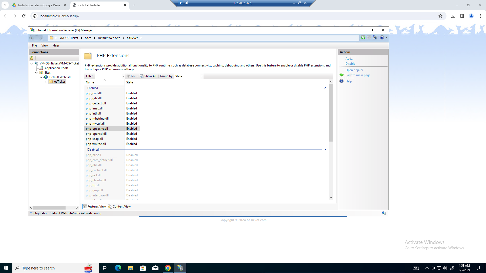
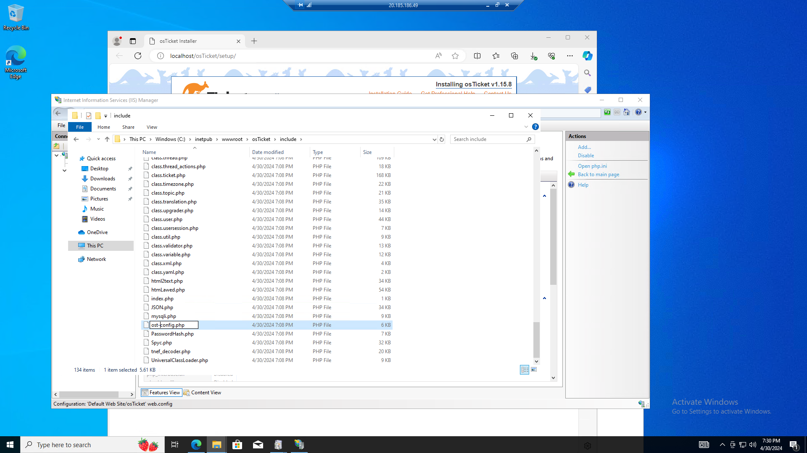
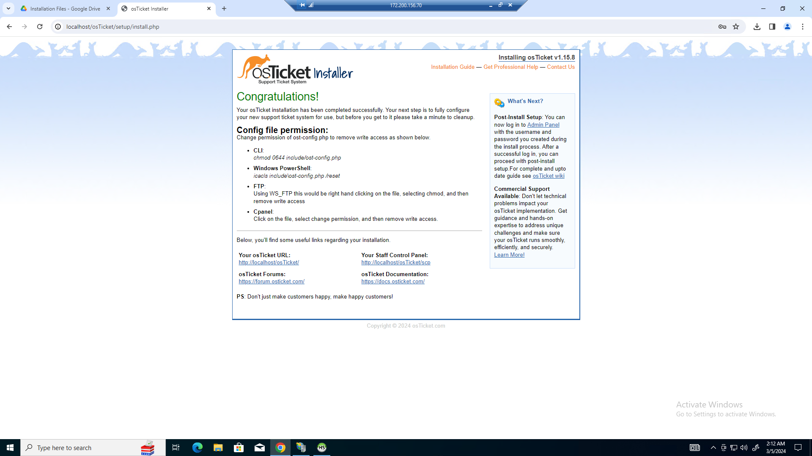

<h1>osTicket - Prerequisites and Installation</h1>
This tutorial outlines the prerequisites and installation of the open-source help desk ticketing system osTicket. 

<h2>Environments and Technologies Used</h2>

- Microsoft Azure (Virtual Machines/Compute)
- Remote Desktop
- Internet Information Services (IIS)

<h2>Operating Systems Used </h2>

- Windows 10</b> (21H2)

<h2>List of Prerequisites</h2>

- Enable ISS
- Download Needed Resources
- Enable Extensions
- PHP Manager
- Heidi SQL

<h2>Installation Steps</h2> 

<h3><b>Enabling</b> ISS</h3>

Picture 1 - Enabling Application Development Features and common HTTP Features.

  
  
  

Picture 2 - Enabling CGI. Enabling CGI is important because it allows for PHP to be exexuted on the web server.

  

Picture 3 - Using the port 127.0.0.1, you can test to see if ISS was enabled succesfully. 

<h3><b>Installing and Registering PHP</b></h3>

  Picture - 1 After downloading PHP Manager, create a folder named "PHP" in your C: Drive. Then unzip the contents from the PHP manager download file to the file you created in your C: Drive.

 

  

  Picture 2 - Open "ISS" as and administrator and regiester PHP. After registering, reload ISS.

<h3>Installing osTicket</h3>

  

 Picture 4 - After installing osTicket, extract and copy the "upload" folder into the path "c:\inetpub\wwwroot", then rename the "upload" file to "osTicket". Rename it exactly as this will be important.

  

  Picture 5 - Open ISS and navigate the path "sites->Default->osTicket" and click "PHP Manager". Then navigate to "Enable or disable an extention" under the PHP extentions tab. This can bee seen on <b>Picture 3.</b> You can also select "Browse *.80" to open up the local host for osTicket at this time. After enabling the extentions in the next step you can visually see the changes. 

  

  Picture 6 - Once you have reached this page, you need to enable the following: php_imap.dll, php_intl.dll, php_opcache.dll. They are also shown in the picture above.

  

 Picture 7 - Navigate to C:\inetpub\wwwroot\osTicket\include, once you are there, find a file named "ost-sample-config", rename that file to "ost-config". This is importnant because this is the file osTicket uses to operate off of.

 

  Picture 8&9 - Navigate to C:\inetpub\wwwroot\osTicket\include\ost-congfig. Once you are there right-click the file and navigate to properties then security. Once your are there you are going to remove all permissions assigned. Then add a role for everyone, and give the role full access.

<b>Now that your permissions are good go back to where you found *.80. Then click the continue button.</b>

  
  

  

 
<h3><b>Installing and setting up HeidiSQL</b></h3>

  Picture - 1 After installing HeidiSQL, register a new database and name it "osTicket". This will be used when installing osTicket.

  

  Picture 2 - After you created a data base in HeidiSQL, fill out the information shown in the picture. Then press install.

  

 
